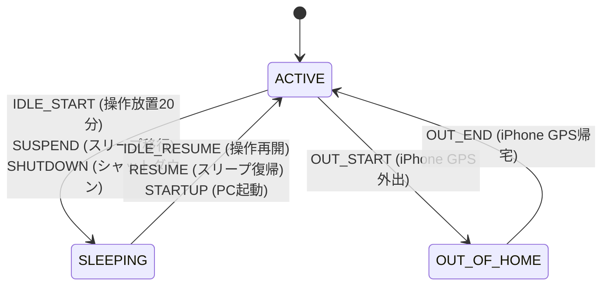

# Sleep Tracker (睡眠時間記録アプリ)

PCの操作状態（キーボード・マウスの入力）および電源状態（スリープ、シャットダウン）から、ユーザーがPCを触っていない時間を「睡眠時間」と仮定して自動記録し、将来の睡眠時間を予測するアプリケーションです。

---

## フォルダ構成とナビゲーション

LLMや開発者がこのリポジトリを階層的に探索しやすくするためのディレクトリ構造とドキュメントの配置情報です。

```
sleep-tracker/
│
├── .agents/
│   └── AGENTS.md             # エージェント共通コーディング規則 (Antigravity & Claude Code)
│
├── README.md                 # 本ファイル (プロジェクト全体概要)
├── pyproject.toml            # Pythonプロジェクト設定 (uv)
│
├── src_cpp/                  # C++ 監視サービス
│   ├── README.md             # C++モジュールの説明とビルド方法
│   └── (C++ソースファイル)
│
└── src_python/               # Python 解析・UI・予測ツール
    ├── README.md             # Pythonモジュールの説明と実行方法
    └── (Pythonソースファイル)
```

### ディレクトリの巡回手順
1. まずルートの [README.md](file:///c:/code/lifestyle/sleep-tracker/README.md)（本ファイル）を読み、全体の役割を理解します。
2. コーディング規則やエージェント間ルールを確認する場合は、[.agents/AGENTS.md](file:///c:/code/lifestyle/sleep-tracker/.agents/AGENTS.md) を参照します。
3. Windows APIによるPC状態の常時監視とハートビート出力のロジックは [src_cpp/README.md](file:///c:/code/lifestyle/sleep-tracker/src_cpp/README.md) に従い、`src_cpp/` ディレクトリ配下を調査します。
4. ログ解析、睡眠予測、およびユーザーインターフェース（ログ表示）は [src_python/README.md](file:///c:/code/lifestyle/sleep-tracker/src_python/README.md) に従い、`src_python/` ディレクトリ配下を調査します。

---

## 動作要件
- OS: Windows 10 / 11
- C++ビルド環境: MSVC (cl) または GCC (g++)
- Python環境: Python 3.12+ (uv ツールを使用)

---

## 新PCへの移植手順

過去の睡眠記録は `sleep_events.txt` に蓄積され Git で管理されています。新PCでは以下の手順だけで過去の記録ごと引き継げます。

### 1. リポジトリのクローンと環境構築

```bash
git clone https://github.com/zappyzed100/sleep-tracker.git
cd sleep-tracker
uv sync          # .venv を作成し依存パッケージをインストール
```

### 2. デスクトップショートカットの作成

エクスプローラーで `.venv\Scripts\pythonw.exe` を右クリックしてショートカットを作成し、プロパティの「リンク先」を以下のように変更してデスクトップに置く。

```
C:\...\sleep-tracker\.venv\Scripts\pythonw.exe "C:\...\sleep-tracker\src_python\main.py"
```

または、既存の `setup_shortcuts.py` を実行する:

```bash
uv run python src_python/setup_shortcuts.py
```

### 3. ショートカットを起動するだけで完了

UIを初回起動すると自動で以下を実行します:

| 処理 | 内容 |
|------|------|
| **SQLite 再構築** | `sleep_events.txt` から過去の全睡眠セッションを再生成 |
| **スタートアップ登録** | Windows 起動時に監視モニターが自動起動するよう登録 |
| **監視モニター起動** | タスクトレイにアイコンが表示され、即座に記録開始 |

> **データの引き継ぎ範囲**: `sleep_events.txt` に記録された全イベントが復元されます。SQLite は派生データのため git 管理対象外ですが、毎回 `sleep_events.txt` から完全再生成できます。

---

## 要望と実装ステータス一覧

現在の実装状況。

### 核心機能（睡眠の記録と検知）
- [x] **睡眠時間の記録**
  - **実装状態**: 実装済み。PC未使用時間および電源オフ期間を自動で記録します。
  - **関連コード**: [database.py](file:///c:/code/lifestyle/sleep-tracker/src_python/database.py)
- [x] **PC未使用時は眠っていると仮定**
  - **実装状態**: 実装済み。一定時間（20分）PC操作がない場合に睡眠とみなします。
  - **関連コード**: [main.cpp](file:///c:/code/lifestyle/sleep-tracker/src_cpp/main.cpp), [monitor.py](file:///c:/code/lifestyle/sleep-tracker/src_python/monitor.py)
- [x] **PCの電源が入っていても長時間放置されたら睡眠と判定**
  - **実装状態**: 実装済み。`IDLE_START`から`IDLE_RESUME`までの時間を抽出してSQLiteへ記録。
  - **関連コード**: [database.py](file:///c:/code/lifestyle/sleep-tracker/src_python/database.py)
- [x] **PC電源オフ（スリープ・シャットダウン）も睡眠として扱う**
  - **実装状態**: 実装済み。電源イベント監視に加え、突然の電源断でも1分ごとの「生存信号（ハートビート）」の途絶と次回起動時刻のギャップから睡眠時間を自動逆算します。
  - **関連コード**: [main.cpp](file:///c:/code/lifestyle/sleep-tracker/src_cpp/main.cpp) (ハートビート送信), [database.py](file:///c:/code/lifestyle/sleep-tracker/src_python/database.py) (ギャップ解析)
- [x] **iPhone GPS による外出検知と睡眠除外**
  - **実装状態**: 実装済み。GitHub Gist を中継して iPhone の位置情報トリガーから外出・帰宅をPCに同期。外出期間中にPCが放置されても、睡眠時間としてカウントせず自動除外します。
  - **関連コード**: [gist_setup.py](file:///c:/code/lifestyle/sleep-tracker/src_python/gist_setup.py) (中継自動構築), [database.py](file:///c:/code/lifestyle/sleep-tracker/src_python/database.py) (Gist同期 & 外出除外ロジック)

### 自動化とアクセス性
- [x] **PC起動時の自動実行**
  - **実装状態**: 実装済み。Windowsスタートアップフォルダへのショートカット自動登録処理を用意。
  - **関連コード**: [setup_shortcuts.py](file:///c:/code/lifestyle/sleep-tracker/src_python/setup_shortcuts.py)
- [x] **タスクバー（またはデスクトップ）のショートカットからログ閲覧**
  - **実装状態**: 実装済み。デスクトップに起動ショートカットを作成。これをユーザーがタスクバーにドラッグ＆ドロップしてピン留めすることで要求を満たせます。
  - **関連コード**: [setup_shortcuts.py](file:///c:/code/lifestyle/sleep-tracker/src_python/setup_shortcuts.py), [main.py](file:///c:/code/lifestyle/sleep-tracker/src_python/main.py) (GUI本体)
- [x] **PC操作開始時に自動でGitへ変更（ログ）をpush**
  - **実装状態**: 実装済み。PC操作再開時のログ同期のタイミングで、生ログテキスト (`sleep_events.txt`) を非同期スレッドで自動コミット＆プッシュ（競合防止のリベースプル付き）します。
  - **関連コード**: [database.py](file:///c:/code/lifestyle/sleep-tracker/src_python/database.py) (`git_push_logs()`)
- [x] **GitHub プライベートリポジトリの作成**
  - **実装状態**: 完了。`https://github.com/zappyzed100/sleep-tracker` を private で作成・同期済み。

### 睡眠時間予測ロジック
- [x] **今眠ったら何時間眠ることになるかを予測**
  - **実装状態**: 実装済み。データが少ない内は「同時刻帯の平均」を用いる統計モデル、ログが10件以上揃うと `scikit-learn` の Random Forest Regressor を用いた機械学習モデルによる予測に自動で切り替わります。
  - **関連コード**: [analyzer.py](file:///c:/code/lifestyle/sleep-tracker/src_python/analyzer.py)
- [x] **予測特徴量に入眠時刻と「連続覚醒時間」を導入**
  - **実装状態**: 実装済み。入眠時刻の周期特徴量（sin/cos変換）、曜日（One-Hot）、および「最後の睡眠セッションが終了（起床）してから現在までの経過時間（連続覚醒時間）」を特徴量に組み込んで予測します。
  - **関連コード**: [analyzer.py](file:///c:/code/lifestyle/sleep-tracker/src_python/analyzer.py) (`predict_with_ml()`)

### 開発プロセス・ルール
- [x] **いきなり実装せずに実装方法を議論**
  - **実装状態**: 完了。実装計画書を作成し合意を得た上で開発しました。
- [x] **Pythonはuvを使用、C++も併用**
  - **実装状態**: 完了。`uv add` で依存環境を構築し、軽量常駐監視をC++、GUI・分析・Git操作をPythonで実装しました。
- [x] **全ファイル500行以下**
  - **実装状態**: 厳守。すべてのソースコードが500行以下で構築されています。
- [x] **ファイルの先頭10行にファイル情報コメントを記述**
  - **実装状態**: 厳守。すべてのソースファイルにヘッダーコメントを記述。
- [x] **各フォルダにREADME.mdを設置し、ナビゲーションを提供**
  - **実装状態**: 厳守。リポジトリルート、`src_cpp/`、`src_python/` にそれぞれ `README.md` を設置しました。
- [x] **AIエージェント間の共通規則を同期する**
  - **実装状態**: 完了。ルートの `.agents/AGENTS.md` にルールを定義し、同期指示を明記。

---

## iPhone 外出検知（iOS ショートカット）のセットアップ手順

Macを持たない環境でも、iPhoneの位置情報トリガーと GitHub Gist API を連携させて外出検知を行うための設定方法です。

### 1. PC側での中継 Gist 作成
1. コマンドプロンプト等で、以下のコマンドを実行します：
   ```bash
   uv run python src_python/gist_setup.py
   ```
2. 画面に **Gist ID** と、iPhone設定用の **アクセストークン (Token)** が表示されます。この2つをiPhone側で設定します。

### 2. iPhone 側のオートメーション作成

iPhoneの「ショートカット」アプリを使用し、以下の3ステップで外出・帰宅の自動通知を設定します。これにより、複雑なJSON作成画面の操作を完全に回避できます。

#### ① 外出時 (自宅から出発したとき)
1. iPhoneで **「ショートカット」** アプリを開き、下部の **「オートメーション」** タブをタップします。
2. 右上の **「＋」** をタップし、トリガーのリストから **「出発」** を選択します。
3. トリガーの条件を以下のように指定し、「次へ」をタップします：
   - **位置情報**: 「自宅」を指定
   - **実行方法**: **「すぐに実行」** を選択（※自動でバックグラウンド実行するために必須です）
4. **「新規空のオートメーション」** を選択し、検索窓から **「日付」** アクションを検索して追加します。
   - （自動的に「現在の日付」が設定されたアクションになります）
5. そのすぐ下に、検索窓から **「テキスト」** アクションを検索して追加し、入力欄に以下のJSONを貼り付けます：
   ```json
   {
     "files": {
       "mobile_event.txt": {
         "content": "LEAVE,現在の時刻"
       }
     }
   }
   ```
   - 貼り付けた後、`LEAVE,現在の時刻` の「`現在の時刻`」の部分を消し、キーボードのすぐ上にある **「日付」**（ステップ4で作った変数）をタップして挿入します。
   - 挿入した青文字の **[日付]** をタップし、以下を設定します：
     - **日付フォーマット**: 「カスタム」
     - **フォーマット文字列**: `yyyy-MM-dd HH:mm:ss` （すべて小文字）
6. そのすぐ下に、検索窓から **「URLの内容を取得」** アクションを検索して追加し、以下を設定します：
   - **URL**: `https://api.github.com/gists/YOUR_GIST_ID`
   - **方法**: `PATCH` を選択
   - **ヘッダ**: 「新規ヘッダを追加」を2回タップして以下を登録：
     - キー: `Authorization` ➡ 値: `Bearer YOUR_GITHUB_TOKEN`
     - キー: `User-Agent` ➡ 値: `iOS-Shortcut`
   - **要求本文**: **「ファイル」** を選択
   - **ファイル**: タップして、キーボードの上から **「テキスト」**（ステップ5のテキストアクションの出力）を選択します。
7. 右上の **「完了」** をタップして保存します。

#### ② 帰宅時 (自宅に到着したとき)
1. 同様に **「オートメーション」** タブの右上から **「＋」** ➡ **「到着」** を選択します。
2. トリガーの条件を以下のように指定し、「次へ」をタップします：
   - **位置情報**: 「自宅」を指定
   - **実行方法**: **「すぐに実行」**
3. **「新規空のオートメーション」** を選択し、同様に **「日付」** アクションを追加します。
4. その下に **「テキスト」** アクションを追加し、要求本文となる以下のJSONを貼り付けます：
   ```json
   {
     "files": {
       "mobile_event.txt": {
         "content": "ARRIVE,現在の時刻"
       }
     }
   }
   ```
   - 同様に `ARRIVE,` の直後に **「日付」**（ステップ3の変数）を挿入し、タップして日付フォーマットを「カスタム」、フォーマット文字列を `yyyy-MM-dd HH:mm:ss` に設定。
5. その下に **「URLの内容を取得」** アクションを追加し、以下を設定（外出時とほぼ同一）：
   - **URL**: `https://api.github.com/gists/YOUR_GIST_ID`
   - **方法**: `PATCH`
   - **ヘッダ**:
     - `Authorization`: `Bearer YOUR_GITHUB_TOKEN`
     - `User-Agent`: `iOS-Shortcut`
   - **要求本文**: **「ファイル」** を選択
   - **ファイル**: キーボードの上から **「テキスト」** を選択。
6. 右上の **「完了」** をタップして保存します。

---

## 睡眠時間計算の詳細アルゴリズム仕様

本アプリでは、PCの稼働状況および操作状態から、以下の状態遷移モデル（ステートマシン）に基づいて睡眠セッションを自動的に算出・確定します。

### 1. 状態遷移とイベント検知
PCの状態を `ACTIVE`（活動中）と `SLEEPING`（睡眠中）の2つの基本状態で管理します。



- **睡眠開始トリガー**:
  - `IDLE_START`: ユーザーが最後にキーボードやマウスを操作してから20分が経過した際、その20分前の時刻を睡眠開始とみなします。
  - `SUSPEND`/`SHUTDOWN`: PCがスリープに入る、またはシャットダウンされた時刻を睡眠開始とみなします。
- **睡眠終了トリガー**:
  - `IDLE_RESUME`: 放置状態からユーザーが操作を再開した時刻を睡眠終了とみなします。
  - `RESUME`/`STARTUP`: PCがスリープから復帰、または起動された時刻を睡眠終了とみなします。

### 2. 突然の電源断（強制終了）のフォールバック検知
PCが正常なスリープ/シャットダウン処理を行わずに電源が切れた場合、イベントログに `SHUTDOWN` が記録されず、次回起動時に突然 `STARTUP` が出現します。これを防ぐために**生存信号（ハートビート）**を用いて補正します。

- 監視サービスは1分ごとに `sleep_heartbeat.txt` に現在時刻と現在のアイドル時間を上書き保存し続けます。
- 次回起動時、直前のPC稼働記録から **4時間以上のギャップ** が空いており、かつ終了イベントが記録されていない場合、突然の電源断と判断します。
- 睡眠開始時刻 ＝ 「最後のハートビートの時刻 - その時のアイドル時間」（＝ユーザーが最後にPCを操作していた時刻）として補正し、睡眠を確定させます。

### 3. 外出中（iPhone GPS）の睡眠除外ガード
PCを触っていない時間であっても、外出している場合は睡眠中ではありません。
- iPhoneの位置情報から `OUT_START`（外出開始）を受け取ると、システムは `is_out = True`（外出中）状態になります。
- 外出中にPCがどれだけ放置されて `IDLE_START` がログに記録されても、**睡眠状態（`SLEEPING`）への遷移をガード（無視）**します。
- もし仮にPCを放置して睡眠中と判定されていた状態で外出（`OUT_START`）が開始された場合、**外出が始まった瞬間の時刻で睡眠セッションを強制終了（確定）**し、`ACTIVE` 状態に戻します。
- `OUT_END`（帰宅）を受け取ると、外出中フラグが解除され、通常のPC放置による睡眠判定が再開されます。


