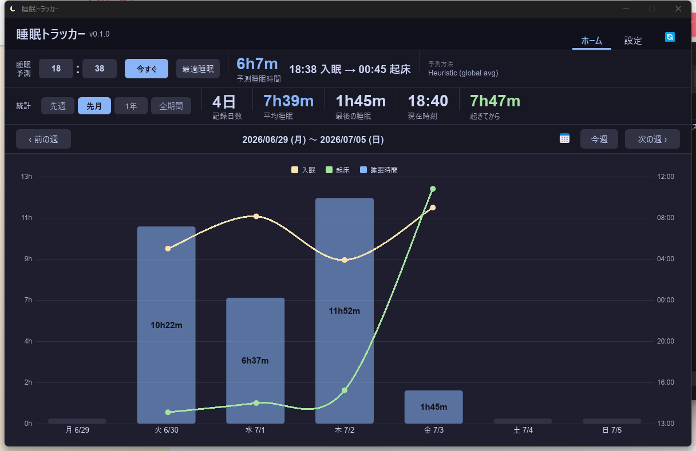
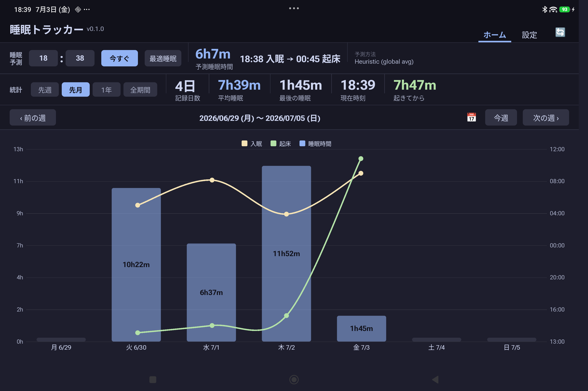

# Sleep Tracker

PC のキーボード・マウス操作の有無からアイドル時間を自動検知し、「PC を長時間触っていない＝睡眠中」という仮定で睡眠時間を記録・可視化・予測するアプリです。Windows 版と Android 版があり、Google スプレッドシート経由でデータを同期します。

| PC 版（Windows） | Android 版 |
|:---:|:---:|
|  |  |

現在の実装は **Rust + Slint**（`src_slint/`）です。以前は C++ → Python、その後 React + Tauri で作られていましたが、いずれも `legacy/` 以下に参照用として残っているだけで、現在はメンテナンス対象外です。

---

## ダウンロード

GitHub のアカウントやビルド環境がなくても、以下からビルド済みファイルを直接ダウンロードできます。

**[→ Releases ページ（最新版）](https://github.com/zappyzed100/sleep-tracker/releases/latest)**

| OS | ファイル | 手順 |
|----|---------|------|
| Windows | `SleepTracker-Windows.exe` | ダウンロードしたらそのままダブルクリックで起動（インストーラー不要） |
| Android | `SleepTracker-Android.apk` | ダウンロードして端末上でファイルをタップ →「インストール」（初回は「提供元不明のアプリ」の許可が必要。[③ Android アプリのセットアップ](#③-android-アプリのセットアップ任意) 参照） |

> Android版はデバッグ署名の apk です（Google Play 非公開・個人利用向け）。ウイルス対策ソフトや Android が警告を出すことがありますが、ソースコードはすべてこのリポジトリで公開されています。

ソースからビルドしたい場合は [② PC アプリのセットアップ](#②-pc-アプリwindowsのセットアップ) 以降を参照してください。

---

## 機能

- **自動記録** — PC 操作がない時間をリアルタイムで睡眠として検知（シャットダウン・スリープも対応）
- **週別グラフ** — 日別の睡眠時間・入眠起床時刻をグラフで確認
- **睡眠時間予測** — 「今眠ったら何時間眠れるか」を機械学習モデルで予測
- **Google Drive バックアップ** — 同期のたびに睡眠ログを Drive へ保存。PC 移行も手間なし
- **ローカル自動バックアップ** — 1日ごとに `sleep_events.txt`/`sleep_manual.txt` を `data/backups/` へ自動保存（世代は自動削除しない、手動で削除可能）
- **監視中断 / 再開** — UI から手動で睡眠検知を一時停止
- **外出除外** — スマートフォンの位置情報（GPS）を検知して外出中の誤記録を自動除外
- **タブレット利用除外** — タブレットで読書・動画視聴などをしていた区間を検知し、PC放置中の誤った睡眠判定を自動除外
- **暫定睡眠時間の表示** — 就寝中に一瞬起きてタブレットを確認した際、まだ確定していない進行中の睡眠時間を表示（起床すると通常のセッションとして確定する）
- **Android ビューアー** — タブレットやスマートフォンで睡眠ログを確認（Drive 経由で PC と同期）

---

## 動作環境

| 項目 | 要件 |
|------|------|
| PC | Windows 10 / 11 (64-bit) |
| Android（任意） | Android 7.0 以降 |
| クラウド | Google アカウント（バックアップ・モバイル連携に使用） |

---

## セットアップの全体像

```
① Google Apps Script をデプロイ（クラウド中継サーバー）
      ↕ HTTPS
② PC アプリ（Windows）           ③ Android アプリ（任意ビューアー）
   ・睡眠自動検知                    ・睡眠グラフ閲覧
   ・Drive バックアップ              ・Drive からデータ取得・タブレット利用区間の送信
      ↕ スプレッドシート
④ MacroDroid / iPhone ショートカット
   ・外出／帰宅を GAS へ通知
```

セットアップ順：**① → ② → ③（任意）→ ④（任意）**

---

## ① Google Apps Script のセットアップ

PC と Android の両方が使うクラウド中継を作ります。

### 1-1. Google スプレッドシートを作成

1. [Google スプレッドシート](https://sheets.google.com) で新しいシートを作成
2. シート名を **`events`** に変更
3. A1 セルに `Timestamp`、B1 セルに `Tag` と入力（ヘッダー行）

### 1-2. Apps Script を設置

1. スプレッドシートのメニュー →「拡張機能」→「Apps Script」
2. エディタに [`worker/appsscript.gs`](worker/appsscript.gs) の内容をすべて貼り付けて保存（Ctrl+S）

### 1-3. シークレットを設定

1. 左サイドバー「プロジェクトの設定」（歯車アイコン）
2.「スクリプト プロパティ」→「プロパティを追加」
   - プロパティ名：`SECRET`
   - 値：任意のランダム文字列（例：`a1b2c3d4e5f6g7h8`）
3. 「保存」

### 1-4. ウェブアプリとしてデプロイ

1.「デプロイ」→「新しいデプロイ」
2. 種類を「ウェブアプリ」に設定
   - 次のユーザーとして実行：**自分**
   - アクセスできるユーザー：**全員**
3.「デプロイ」→ 表示された **URL をコピー**（後で使用）

> デプロイ URL の形式：`https://script.google.com/macros/s/xxxxxxxxxx/exec`

---

## ② PC アプリ（Windows）のセットアップ

### 2-1. 入手

**ビルド済みファイルをダウンロードする場合（推奨）**

上の[ダウンロード](#ダウンロード)から `SleepTracker-Windows.exe` を取得し、実行するだけです。

**ソースからビルドする場合**

```bash
git clone https://github.com/zappyzed100/sleep-tracker.git
cd sleep-tracker/src_slint
cargo build --release   # target/release/sleep_tracker.exe が生成される
```

Rust ツールチェーン（[rustup](https://rustup.rs/)）が必要です。

### 2-2. クラウド連携の設定

1. アプリの「設定」タブを開く
2.「クラウド連携」セクションに以下を入力：
   - **Apps Script URL**：① でコピーした URL
   - **シークレット**：① で設定した SECRET の値
3.「保存」→「接続テスト」で「接続成功」と表示されれば OK

### 2-3. 睡眠判定時間の設定（任意）

設定タブ →「睡眠判定時間」で PC 操作がない時間の閾値を設定します（デフォルト 60 分）。

### 2-4. PC 起動時に自動起動（任意）

設定タブ →「PC 起動時に自動起動する」をオンにするとスタートアップ登録されます。

### 2-5. デスクトップショートカットの作成（任意）

設定タブ →「デスクトップにショートカットを作成」でショートカットを生成。ショートカットを右クリック →「タスクバーにピン留め」でアクセスしやすくなります。

---

## ③ Android アプリのセットアップ（任意）

Sleep Tracker の Android ビューアーは APK を直接インストールします（Google Play 非対応）。

### 3-1. 提供元不明アプリを許可する

インストール方法によって手順が異なります。

**ファイルマネージャーからインストールする場合**

1. 「設定」→「アプリ」→「特別なアプリアクセス」→「提供元不明のアプリ」
2. 「ファイルマネージャー」（またはダウンロードに使ったブラウザ）を選んで「この提供元のアプリを許可」をオン

**ADB 経由でインストールする場合（PC 必須）**

1. 「設定」→「デバイス情報」→「ビルド番号」を 7 回タップ（開発者向けオプションが有効化される）
2. 「設定」→「開発者向けオプション」→「USB デバッグ」をオン
3. PC と USB 接続し、端末側で「USB デバッグを許可しますか？」→「許可」

### 3-2. APK のインストール

**ファイル転送でインストールする場合**

1. 上の[ダウンロード](#ダウンロード)から `SleepTracker-Android.apk` を端末で直接ダウンロード、
   またはメール・Google Drive・USB などで転送
2. 端末上でファイルをタップ →「インストール」

**ADB でインストールする場合（PC に Android SDK が必要）**

```bash
adb install SleepTracker-Android.apk
```

**ソースからビルドする場合**

`src_slint/android/README.md` を参照（Rust の cdylib を `cargo ndk` でビルドし、`gradlew assembleDebug` で APK を生成します）。

### 3-3. Android アプリの設定

1. アプリを起動 →「設定」タブを開く
2. PC アプリと同じ **Apps Script URL** と **シークレット** を入力して「保存」
3. ホームタブに戻ると Drive から睡眠データが自動取得されます

> 初回取得には数秒かかります。起動後しばらくお待ちください。

### 3-4. タブレット利用の除外を有効にする（任意だが推奨）

初回起動時に「使用状況へのアクセス」の許可画面が自動で開きます。これを許可すると、タブレットで実際に読書・動画視聴などをしていた区間を検出し、PC放置中の誤った睡眠判定を防げます（詳細は[外出中・タブレット利用中の除外](#外出中・タブレット利用中の除外)参照）。

1. 表示された一覧から「睡眠トラッカー」をタップ
2. 「アプリの使用状況データへのアクセスを許可する」をON
3. 機種によっては注意喚起のダイアログが出ます。内容を確認しチェックを入れて「OK」

許可しなくてもアプリの基本機能（グラフ閲覧・同期）には影響しません。

---

## ④ モバイル連携（任意）

外出中の PC 放置を睡眠と誤検知しないよう、スマートフォン / タブレットの位置情報を PC へ通知します。

**仕組み：**

```
スマートフォン（MacroDroid / iOS ショートカット）
  └─ 外出・帰宅を Apps Script へ POST
      └─ スプレッドシートに記録
          └─ PC が同期時に取得 → 外出期間の放置を睡眠から除外
```

### MacroDroid での設定（Android）

MacroDroid を使って「外出」「帰宅」を GAS へ送信します。

**共通の HTTP アクション設定：**

| 項目 | 値 |
|------|-----|
| URL | `{GAS_URL}?secret={SECRET}&tag={TAG}&ts=%datetime:epochmilli%` |
| メソッド | POST |
| ボディ | 空 |
| Content-Length | 0（手動ヘッダーで追加） |

`{GAS_URL}` と `{SECRET}` は ① の値に置き換えてください。

**マクロ 1：外出検知**

| 項目 | 設定 |
|------|------|
| トリガー | ジオフェンス（自宅エリアを登録）→「エリア外」 |
| アクション | HTTP リクエスト（上記、`tag=LEAVE_HOME`） |

**マクロ 2：帰宅検知**

| 項目 | 設定 |
|------|------|
| トリガー | ジオフェンス →「エリア内」 |
| アクション | HTTP リクエスト（上記、`tag=ARRIVE_HOME`） |

> タブレットの利用検知（読書・動画視聴などを睡眠判定から除外する仕組み）は Android ビューアーアプリ自身が自動で行うため、MacroDroid 側でのマクロは不要です。

### iPhone ショートカットでの設定（iOS）

iPhone の「ショートカット」アプリ →「オートメーション」→「＋」から作成します。

**外出時オートメーション**

| 手順 | 操作 |
|------|------|
| トリガー | 「出発」→ 位置情報：自宅 → **すぐに実行** |
| アクション 1 | 「日付」（フォーマット：カスタム `yyyy-MM-dd HH:mm:ss`） |
| アクション 2 | 「URL の内容を取得」→ 方法：GET / URL：`{GAS_URL}?secret={SECRET}&tag=LEAVE_HOME&ts=日付変数` |

**帰宅時オートメーション**

「出発」→「到着」、`LEAVE_HOME` → `ARRIVE_HOME` に変更。他は同じ。

---

## 使い方

### PC アプリ

アプリは **バックグラウンド監視（タスクトレイ）** と **UI ウィンドウ** で構成されます。

| コンポーネント | 役割 |
|--------------|------|
| タスクトレイアイコン（三日月） | 常駐して睡眠を自動記録 |
| UI ウィンドウ | ログ閲覧・予測・設定。必要なときだけ開く |

- UI を閉じても**タスクトレイは動き続けます**
- タスクトレイを右クリック →「終了」でプログラムが終了します

**クラウド同期（「今すぐ同期」ボタン）**

1. スプレッドシートからモバイルイベント（外出・帰宅・タブレット利用区間など）を取得してローカルに統合
2. ローカルの `sleep_events.txt` を並び替え・重複除去
3. 整理済みファイルを Google Drive にバックアップ

同期は起動後から 5 分ごとに自動実行されます。

**ローカル自動バックアップ**

Drive への同期とは別に、1日ごとに `sleep_events.txt`/`sleep_manual.txt` のスナップショットを `data/backups/` に保存します（前回から24時間経過していれば取得）。世代は自動削除されないため、不要になったら設定タブの「バックアップを削除」で手動削除してください。Drive 同期が止まっていた場合のローカル側の保険用途です。

- PC 版：常駐監視スレッドが毎時判定するため、アプリを閉じていない限り確実に1日おきに取得されます
- Android 版：常駐スレッドを持てないため、アプリを開いた時（起動時・5分ごとのフォアグラウンド同期時）に判定されます。アプリを開かない期間が続くと取得されません

**データ管理（設定タブ →「データ管理」）**

| ボタン | 効果 |
|-------|------|
| ローカルの全データ削除 | `sleep_events.txt`/`sleep_manual.txt` だけを空にする（Drive・スプレッドシートは残る） |
| クラウドも含めて全データ削除 | ローカルに加えて Drive のバックアップファイル・スプレッドシートの記録も全消去する |
| データを圧縮 | 現在パースされているセッション一覧だけの最小構成に `sleep_events.txt` を作り直す。`sleep_manual.txt`（手動追加分）はセッション一覧に統合済みとして空にする。作り直した内容は Drive・スプレッドシートにも反映される |
| バックアップを削除 | 上記の日次ローカル自動バックアップ（`data/backups/`）を全削除する。`sleep_events.txt`/`sleep_manual.txt` 本体やクラウドには影響しない |

いずれも誤操作防止のため 2 回クリックで実行されます（1 回目は確認メッセージのみ）。

**監視の中断と再開**

| 状態 | タイトルバーの表示 |
|------|------|
| 通常 | 「検知中」（緑）→「中断する」で一時停止 |
| 中断中 | 「検知中断中」（黄）→「再開する」で再開 |

### Android ビューアー

- ホームタブ：PC と同じ週別グラフ・予測カードが表示されます
- ホームタブ ↔ 設定タブ：画面上部のタブで切り替え（設定タブでは OS の戻るボタンでホームに戻れます）
- グラフを左右にスワイプすると前週・次週に移動します
- データは Drive から自動取得（アプリ起動時・前面復帰時）
- タブレットでの実際のアプリ利用区間（読書・動画視聴など）は「使用状況へのアクセス」権限を許可すると自動検出され、アプリを開くたびに前回確認時点からの利用履歴をまとめて送信されます（初回起動時に許可を求めるダイアログが表示されます）

---

## 新 PC への移行

1. [ダウンロード](#ダウンロード)から `SleepTracker-Windows.exe` を取得（またはソースからビルド）
2. 設定タブで Apps Script URL とシークレットを入力して保存
3.「今すぐ同期」を押すと Drive から `sleep_events.txt` が自動復元されます

> `sleep_events.txt` が存在しない場合、起動時に Drive から自動復元も試みます。

---

## アンインストール

1. タスクトレイアイコンを右クリック →「終了」
2. 設定タブ →「PC 起動時に自動起動する」をオフ
3. デスクトップショートカット `睡眠トラッカー.lnk` を削除
4. `SleepTracker-Windows.exe`（またはリポジトリフォルダごと）を削除

---

## 仕組み

### 睡眠検知の状態遷移（PC）

```
PC 操作あり (ACTIVE)
  ├─ N 分間操作なし ──→ IDLE_START（睡眠開始とみなす）
  ├─ スリープ移行 ───→ SUSPEND
  └─ シャットダウン ──→ SHUTDOWN

睡眠中 (SLEEPING)
  ├─ 操作再開 ───────→ IDLE_RESUME（睡眠終了）
  ├─ スリープ復帰 ───→ RESUME
  └─ PC 起動 ────────→ STARTUP
```

N は設定タブの「睡眠判定時間」で変更できます（デフォルト 60 分）。

### 外出中・タブレット利用中の除外

スマートフォンから届く `LEAVE_HOME` / `ARRIVE_HOME`（GPS由来）が `OUT_START` / `OUT_END` として記録されます。また、タブレットで実際にアプリを使っていた区間（`UsageStatsManager` 由来）が `APP_USAGE_START` / `APP_USAGE_END` として記録されます。いずれも「起きていた証拠」として全く同じ扱いで、この期間中の PC アイドルは睡眠から除外されます。

> タブレットの電源が入っているだけ（画面ONだが未操作）では「起きていた」とは判定しません。実際にアプリを使っていた区間だけを見るのは、画面ONの継続時間だけでは「起きている/寝ている」を区別できないため（詳細な設計検証は開発時のプロトタイプ参照）です。短すぎる利用（1分未満）はノイズとして無視し、近接する利用は1回の利用として統合してから判定します。

PC 操作（`IDLE_START` など）またはタブレットの実利用（`APP_USAGE_START`）が検知された場合、外出中でも自動的に `IN_HOUSE` イベントを記録して外出状態を解除します。

### 暫定睡眠時間の表示

就寝中に一瞬起きてタブレットを開くと、まだ `IDLE_RESUME`（起床）が来ていない進行中の睡眠セッションの経過時間を「暫定」として表示します（外出中は対象外）。表示は10秒ごとにローカルの時計計算だけで更新され、都度ネットワーク同期はしません。

この表示のためには、PC 側で記録された最新の `IDLE_START` がタブレット側に届いている必要があります。PC は `IDLE_START` 検知時に即座に Drive へ push しますが、その一回限りの push が失敗した場合に備えて、PC の周期処理（60秒ごと）でも pull と合わせて push をやり直します。

### 突然の電源断への対応

30 秒ごとにハートビート（最終稼働時刻）を保存します。次回起動時にギャップがある場合、自動補正してセッションを推定します。

### 睡眠時間の予測

| データ量 | モデル |
|---------|-------|
| 10 件未満 | 同時刻帯の過去平均（ヒューリスティック） |
| 10 件以上 | Random Forest Regressor（入眠時刻・曜日・連続覚醒時間を特徴量） |

---

## ファイル構成

```
sleep-tracker/
├── src_slint/               # 現行実装（Rust + Slint、PC・Android共通コードベース）
│   ├── src/
│   │   ├── core/            # events.rs（セッション解析）, cloud.rs（同期）, config.rs
│   │   ├── platform/        # windows.rs（トレイ・スタートアップ）, monitor.rs（アイドル検知）
│   │   └── ui/               # Slint側UIとの連携コード
│   ├── ui/main.slint        # 全UI定義
│   ├── android/              # Gradle + cargo-ndk（Android真バックグラウンド同期用）
│   ├── data/
│   │   ├── sleep_events.txt     # 睡眠ログ（ローカル正本）
│   │   ├── sleep_heartbeat.txt  # ハートビート（30 秒ごと更新）
│   │   └── backups/             # 日次ローカル自動バックアップ（世代は自動削除しない）
│   └── config.json          # Apps Script URL・シークレット・閾値（git 管理外）
├── worker/
│   └── appsscript.gs         # Google Apps Script（モバイル受信・Drive バックアップ）
├── docs/screenshots/          # README用スクリーンショット
└── legacy/                   # 過去の実装（C++ → Python → React + Tauri の順、参照用・メンテナンス対象外）
```

### sleep_events.txt のイベント種別

| イベント | 発生源 | 意味 |
|---------|--------|------|
| `IDLE_START` | PC モニター | PC のアイドルが閾値を超えた（睡眠開始） |
| `IDLE_RESUME` | PC モニター | PC 操作再開（睡眠終了） |
| `STARTUP` | PC モニター | PC 起動 |
| `SHUTDOWN` | PC モニター | PC シャットダウン |
| `SUSPEND` | PC モニター | PC スリープ |
| `RESUME` | PC モニター | PC スリープ復帰 |
| `OUT_START` | スマートフォン | 外出開始（LEAVE_HOME から変換、GPS由来） |
| `OUT_END` | スマートフォン | 帰宅（ARRIVE_HOME から変換、GPS由来） |
| `IN_HOUSE` | PC / タブレット | 外出状態の自動解除（PC 操作またはタブレットの実利用を検知） |
| `APP_USAGE_START` / `APP_USAGE_END` | タブレット | 実際にアプリを使っていた区間（`UsageStatsManager`由来）。睡眠判定から除外され、在宅解除にも使われる |
